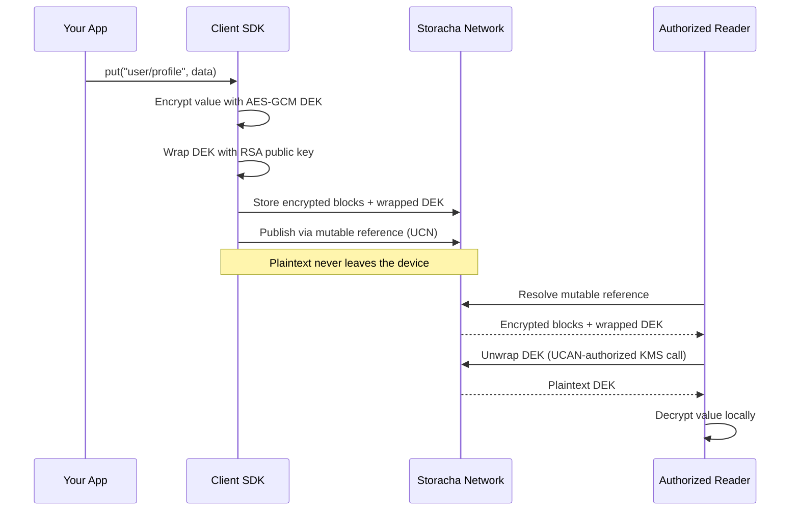

# Encrypted key-value storage

```javascript
import { Name, Revision, Value } from '@storacha/ucn/pail'
import { MemoryBlockstore } from '@storacha/ucn/block'

// Create a mutable, encrypted key-value store
const name = await Name.create()
const blocks = new MemoryBlockstore()

// Store a value under a key
const init = await Revision.v0Put(blocks, 'user/profile', profileCID)
const value = Value.create(name, init.revision.operation.root, [init.revision])

// Update it later
const update = await Revision.put(blocks, value, 'user/settings', settingsCID)

// Share read access with another user
const proof = await Name.grant(name, recipientDID, { readOnly: true })
```

You just created a mutable, shareable key-value data store on Storacha. The address stays the same even as data changes, multiple users can read and write concurrently without conflicts, and when you add encryption only key holders can read the values. The network never sees your plaintext.

## What you can build

- **Private user data** -- Store user preferences, health records, or financial data where even the storage infrastructure cannot read it. The encryption happens on the client before anything hits the network, so privacy is zero-knowledge by design, not just by policy.
- **Collaborative encrypted apps** -- Multiple users read and write shared encrypted state without stepping on each other's changes. Think Google Docs for sensitive data: meeting notes, medical records, legal documents. The underlying CRDT handles concurrent writes, and UCAN delegations handle who gets access.
- **Mutable content references** -- Application configs, profile pointers, or metadata that update without breaking existing links. You get a stable address for changing content, which means external systems can bookmark your data without worrying about stale URLs.
- **User-controlled data** -- Users own their data, grant access to specific apps, and revoke it whenever they choose. When access is revoked, decryption keys become unreachable. The data belongs to the user, not the platform.

## What this replaces

**Before Storacha:** You roll your own encryption layer on top of a cloud database. You build a key exchange protocol so multiple users can share access. You implement conflict resolution for concurrent encrypted writes -- which is brutally hard when the data is opaque ciphertext. You handle key rotation when a user is removed. You maintain all of this across web, mobile, and server environments, and you pray that your homegrown crypto doesn't have subtle bugs. Timeline: months of engineering. Ongoing maintenance: forever.

**With Storacha:** You call a few APIs. The client SDK encrypts data on the device, stores it to the network, and publishes it under a mutable reference. You grant or revoke access with a single UCAN delegation. Concurrent writes merge automatically. Timeline: an afternoon.

The hard problems -- conflict-free concurrency, envelope encryption, hardware-backed key management, decentralized identity -- are solved once in the platform so you don't solve them again in every app.

## How it works

Three building blocks snap together to give you encrypted mutable key-value storage.

### Mutable references

A mutable reference is a stable address whose content can update over time. You create a reference, publish data to it, change the data, and the address stays the same. Anyone who knows the address can resolve it to the latest value. You control who can update it and who can read it through UCAN delegations -- grant full access or read-only access to any other user.

_Under the hood, this uses User Controlled Names (UCN). Each name is an ed25519 keypair with a `did:key` identifier. Publishing a new value advances a Merkle clock, which provides conflict-free concurrent updates. When two writers update the same name simultaneously, the clock tracks both branches and merges them deterministically so no writes are lost._

### Client-side encryption

Data is encrypted on your device before it ever leaves your machine. The storage network only sees ciphertext -- it cannot read your data, and neither can anyone who intercepts it in transit. You hold the keys. Only users you explicitly authorize can decrypt, and you can revoke that authorization at any time.

_Under the hood, Storacha uses envelope encryption with a Key Management Service (KMS). Your client generates a fresh AES-256 data encryption key (DEK) for each piece of content, encrypts the data locally, then wraps the DEK using an RSA-OAEP public key from the KMS. The corresponding private key lives in hardware-secured Google Cloud KMS and never leaves that boundary. To decrypt, an authorized user sends the wrapped DEK to the KMS via a UCAN-authorized request. The KMS unwraps the DEK and returns it to the client, which decrypts locally. If you revoke someone's UCAN delegation, they lose the ability to call the KMS, and the data becomes unreadable to them._

### Key-value structure

Instead of storing opaque blobs, you store structured data under string keys. Get, put, delete, list -- the same operations you know from Redis or localStorage, but decentralized and content-addressed. Every mutation produces a new immutable root CID, so you get a complete history of changes for free. You can always go back to any previous state by its root.

_Under the hood, this uses Pail, a sharded prefix-trie CRDT stored as a Merkle DAG. Keys that share a common prefix are grouped into child shards, keeping lookups efficient even as the store grows. Because each shard is a content-addressed block, unchanged parts of the trie are shared across revisions -- storage stays compact. The CRDT layer wraps every mutation in a Merkle clock event, so multiple writers can operate concurrently and all replicas converge to the same state regardless of the order they see events._

## Data flow



The critical thing to notice: plaintext only exists on devices that hold valid UCAN delegations. The network transports and stores ciphertext. Even if the storage infrastructure is compromised, your data stays private.

## Choose your path

| I want to... | Guide |
|---|---|
| Update stored content without changing the address | [Store and Update Data](../how-to/store-and-update) |
| Keep my uploads private with encryption | [Encrypt Your Data](../how-to/encrypt-data) |
| Build a full private mutable data store | [Build a Private KV Store](../how-to/private-kv-store) |
| Just upload a file (the basics) | [Upload](../how-to/upload) |

## Next steps

Ready to build? Pick the guide that matches where you are:

- [Store and Update Data](../how-to/store-and-update) walks you through creating mutable references with UCN, publishing values, and resolving them from other clients. Start here if you want mutability without encryption.
- [Encrypt Your Data](../how-to/encrypt-data) covers setting up envelope encryption for a space, encrypting content client-side, and managing access through UCAN delegations. Start here if you want privacy for existing uploads.
- [Build a Private KV Store](../how-to/private-kv-store) combines all three building blocks into a complete encrypted key-value store with concurrent writes, access control, and key rotation. Start here if you want the full picture.
