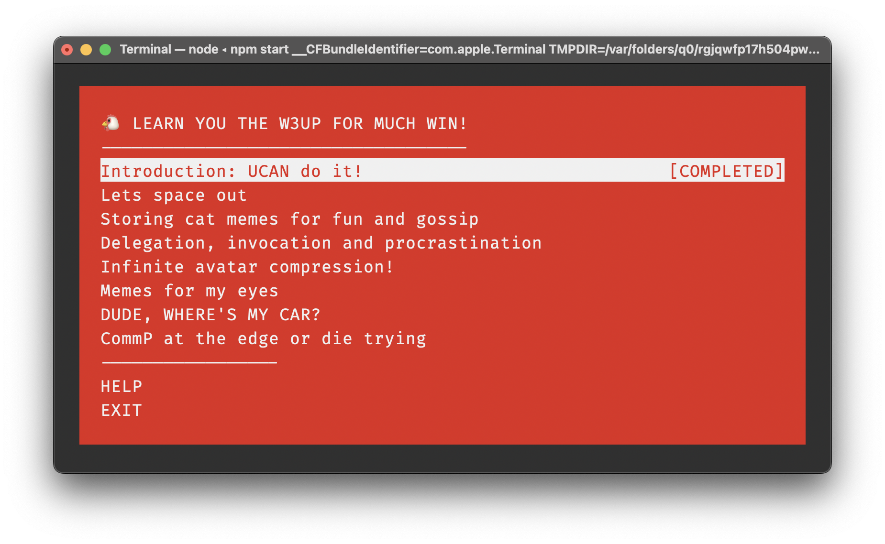

import { Cards, Card } from 'nextra/components'

# Hey there, Storage Superstar!

Welcome to the hottest storage solution in the web3 universe! You've landed at Storacha Network, the dazzling revitalization of Web3.Storage. We're here to keep your data safe, sound, and supercharged with the power of decentralization.

**Under the hood** Storacha uses [UCANs](https://github.com/ucan-wg) for trustless, local-first authorization, and is backed by the provable storage of [Filecoin](https://docs.filecoin.io/basics/what-is-filecoin). Our goal is to enhance Filecoin with a scalable hot storage solution while also ensuring the data is retrievable via [IPFS](https://docs.ipfs.tech/).

When it comes down to building your next application, service, or website, Storacha keeps it simple. You get all the benefits of decentralized storage technologies with the frictionless experience you expect in a modern dev workflow. **To use Storacha, all you need is a key-pair and your data.**

## Where to start?

Whether you're building with **JavaScript**, **TypeScript**  or **Go**, we've got you covered:

- **JavaScript/TypeScript:** Check out our [guide to using the JS client](/js-client).
- **Go:** Explore our guide for [Go client](/go-client) to build robust backend integrations.
- **Command Line:** Dive into our [guide for using the CLI](/cli).

Feeling terminal? Jump in to our **interactive workshop** to learn you the w3up protocol for much win!

Get started by installing it from npm:

```sh
$ npm install -g learnyouw3up
$ learnyouw3up
```

[](https://github.com/storacha/learnyouw3up)
For more details, visit our [learnyouw3up GitHub repository](https://github.com/storacha/learnyouw3up).

## Join the Storacha Party!

Stay connected and be part of the fun with the Storacha community:

- [Discord](https://discord.gg/8uza4ha73R): Jump into our Discord server for live support and endless chats.
- [Github](https://github.com/storacha): Check out our GitHub repos and contribute to our awesome projects.
- [X](https://x.com/storachanetwork): Follow us on X for the latest updates, memes, and more.
- [YouTube](https://www.youtube.com/@StorachaNetwork): Watch tutorials and demos our channel.

## Need a Hand?

Got questions or need a bit of help? Don't hesitate to [contact our support team](mailto:support@storacha.network). We're here to make your Storacha experience as smooth and spicy as possible.

Thanks for joining us on this adventure. Let's make storage history together with Storacha Network - where your data stays hot and happening!

<Cards>
  <Card icon='💾 ' title="CLI" href="/cli" />
  <Card icon='✨ ' title="JS Client" href="/js-client" />
  <Card icon='🐹 ' title="Go Client" href="/go-client" />
</Cards>
